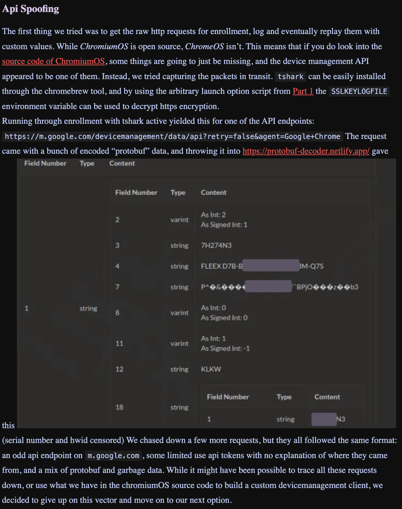
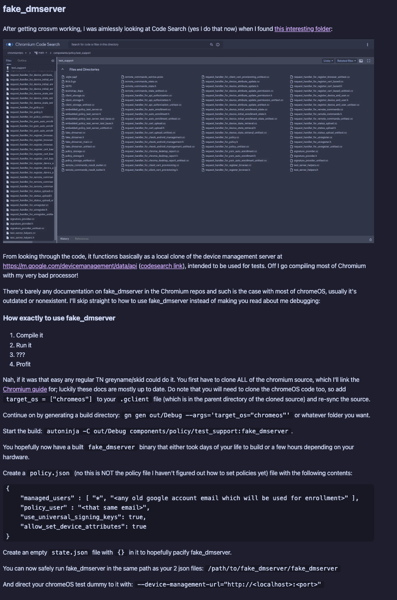
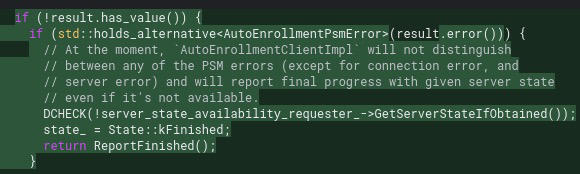
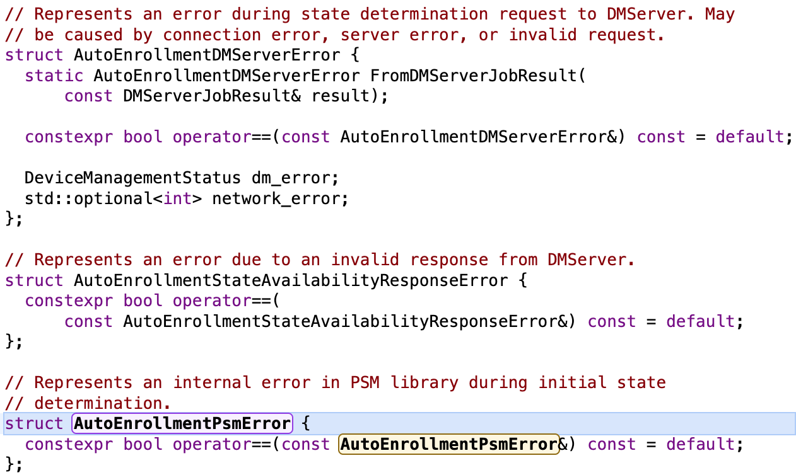

Exploit 8 is pretty cool (we number our exploits). I would recommend going to Velzie's blog (the old one or the new which ever explains sh1mmer) [Velzie's old blog](https://velzieblog.pages.dev/breaking-cros-1/) and reading it before reading this.

---

## Table of Contents

## API Spoofing

Let's start off with the basics. Velzie in his blog put this: 

They mentioned their attempt at API spoofing but they eventually thought this wouldn't work and stopped the project. We decided to continue this. The first step was figuring out how to reproduce what he said in his blog. The first step is https. We have to know how to decrypt this. In his blog he said he used a script to change the launch flags of chrome so he could put it in enviroment variable and get it from there. This is partially a lie. What really happened is he used a launch flag `--ssl-key-log-file=/root/key.log` to log the keys to a file which later can be used to decrypt the packets. If you want the script for to change the launch flags go to [here](https://github.com/PeapGit/APIscript/blob/main/script.sh) So I went and got myself in Dev mode, powerwashed and installed chromebrew while in the OOBE. Then installed Tshark (wireshark is the package name). From here I ran the command `tshark -i any -w /root/savedlogs.pcapng`. But wait what about the keys? Well you should run this before installing chromebrew/tshark at all as this makes this bash script to change the launch flags fail. So doing this (Powerwashing into the OOBE, executing this script, installing tshark, running this command, then going through the OOBE will result in two files appearing in /root. `savedlogs.pcapng and key.log`.) Save these onto a seperate computer which can run the wireshark ui. (Technically you could probably run this using a tshark command but it's a lot easier to just use the UI.) From here load the savedlogs.pcapng into wireshark. You'll see mostly encrypted files. From here go to the wireshark preferences. Go to protocals - TLS. Put in the file path to your key.log into the Pre master Secret Log filename. From here press OK and wireshark should reload with all the packets unencrypted. Finally some actual data we can use! Use the display filter to filter for TLS. This is the only interesting packets with data unencrypted. With this you can see m.google.com urls with post requests. Sadly I along with the rest of bromine never really got the protobuf data as it wasn't in the unencrypted packets. Finally we've got to the end of the velzie blog. But no there's another blog which we need to talk about. 

## R58playz's Fake Dmserver

In this [R58playz's blog](https://www.r58playz.dev/post/breaking-cros-4) we see this: 
In this he says he found the folder which includes a copy of the m.google.com server. You can use this to run your own fake dmserver. All you need is a beefy computer and like 100 GB of available storage. Most people however don't have that so we'll just provide a copy here. [fakedmserver zip](https://filehost.appleflyer.xyz/bromine_public/fake_dmserver.tar.xz)

Running this on say a linode + with an appropriate nginx config to redirect https to the localhost of the server will allow you full access to it from all over the world. 

Placeholder line to REMIND YOU TO PUT THE LINK

Finally you can use that script from before [before](https://github.com/PeapGit/APIscript/blob/main/script.sh) to change the launch flags to `--device-management-url="your linode IP"`. This will unenroll your computer cause r58 didn't bother going past there and not having properly signed policy data will result in unenrollment. 

## Exploit 8 Version 2

Now don't get your hopes up with an unenrollment exploit because of two problems. 

1. You have to be in Dev mode to change Launch flags
2. Even if you didn't do it without launch flags SSL(https) is designed to not let this attack happen.

Let's tackle problem 1. You can use a hotspot + nextDNS on your phone to rewrite requests from one url to another. So you can be in verified, connect your hotspot in the OOBE, and rewrite to our linode url. Here comes the second problem which makes unenrollment with this completely impossible. The problem is SSL. To make sure that a Man in the Middle Attack such as this won't happen, all websites have a certificate which is signed with their private key. This is in sha256 encryption. So in https (which is default in verified. No dns changing in the limited wifi settings in the OOBE is gonna save you) when we redirect it since whatever certificate we have isn't valid the OOBE can't verify the site is actually google is reports an error to console and stops the OOBE entirely in it's tracks. And don't even think about trying to circumvent https in some way. This is using the chrome binary which in itself is the chrome browser we all use. This all means your trying to circumvent the chrome browser which in itself is already extremely secure. The only way is to break SSL - sha256 which the only method that can do this takes traditional computers millions of years to do. Quantum computers less so maybe when quantum computers exist a new unenrollment exploit will be automatically born. Who knows. Onto the last part of this which in bromine was appropriately dubbed 8v2.

## Disproving

In the chromium source code you can find the Policy Management Code. [Policy management code](https://source.chromium.org/chromium/chromium/src/+/main:chrome/browser/ash/policy/) This has all the enrollment code. Now in this  we can see that it first checks if the result has a value. If it doesn't there's an error and we report an error. Next we check if there's a PSM error. If there is we continue cause they don't care about it. Next there's a DCHECK which only matters when debugging but since the code's running compiled and not debugged it does nothing. Finally we report kFinished and run ReportFinished. This will inevitably report kNoEnrollment and we will unenroll. Now me being an absolute idiot decided this PSM error check would include server errors. No it Doesn't. My plan involved putting a mitm server being the chromebook and m.google.com. It would invalidate the packets whenever the packet headers (which are unencrypted) show `source:m.google.com`. This would result in a PSM error which would run ReportFinished. Except this is extremely dumb. PSM errors and server errors are completely Different.  I was being an idiot. 

## Conclusion
This wraps up everything for 8. It took a few months but it was pretty fun.

## -Peap
